# Final Assembly

## Steps

### Step 1
Slide the Catch onto the PrimeBlock Assembly as shown, until it is just in front of the CatchLever. Make sure the orientation of the Catch is correct, with the pointy side facing down and the larger side facing towards the PrimeBlock.

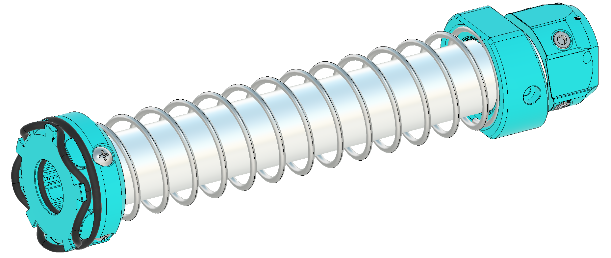
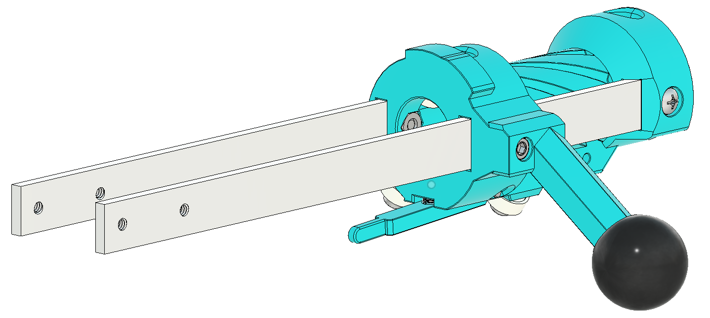
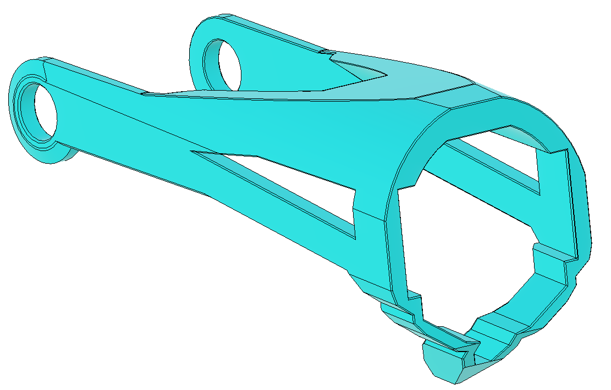

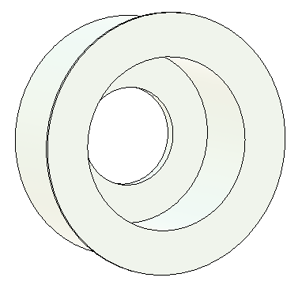

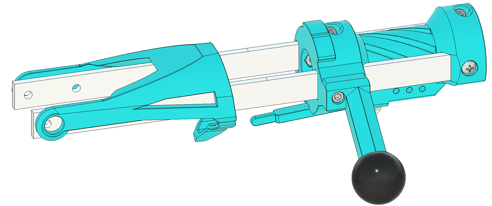

### Step 2
Rotate the Catch Lever down, and insert a  0.625" Long Compression Spring into the bottom of the PrimeBlock as shown. Rotate the Catch Lever back up, trapping the spring into the circular indent on its top, then slide the Catch under the Catch Lever to lock it in place.

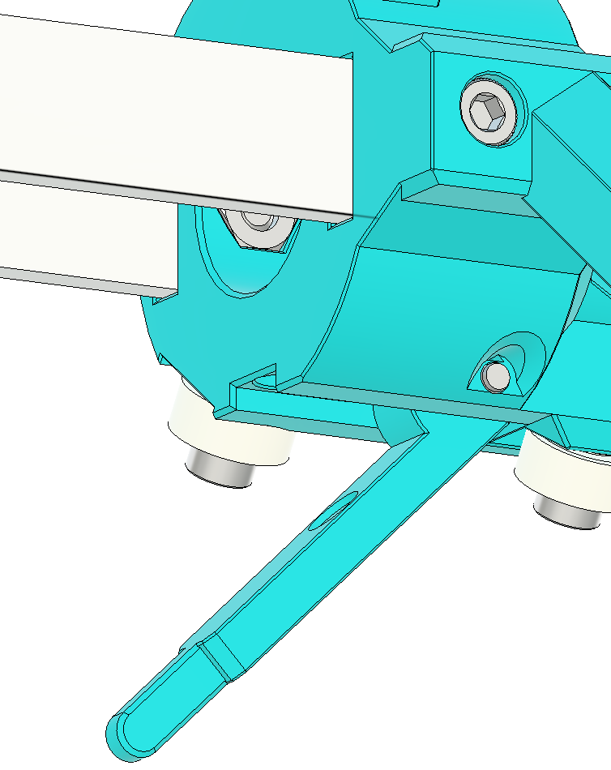
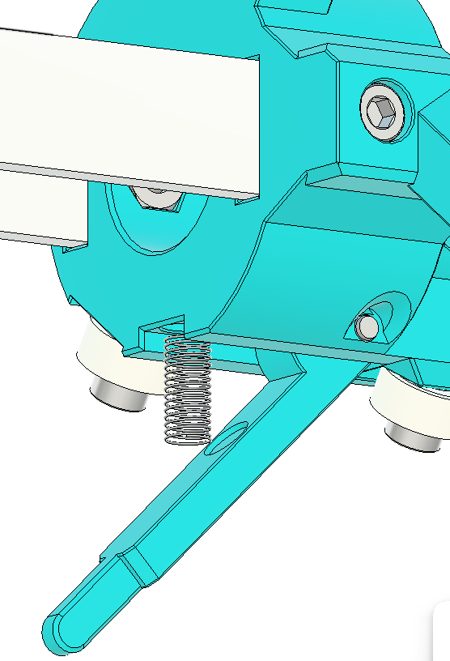
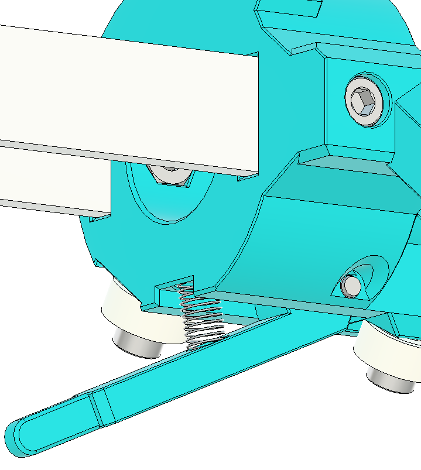
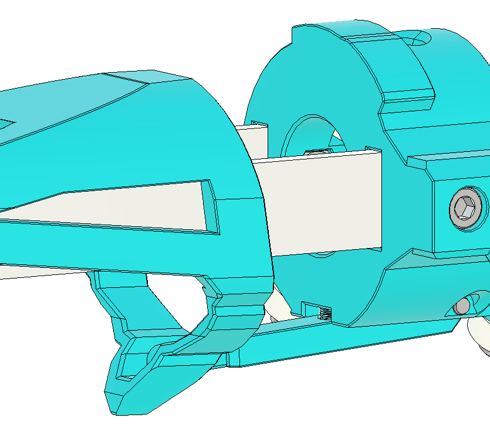

### Step 3
Attach the Catch to the Pump Bars using (2)  6-32 ⅛” Socket Head Screws screwed through (2) CatchBearings. Loctite is highly recommended.

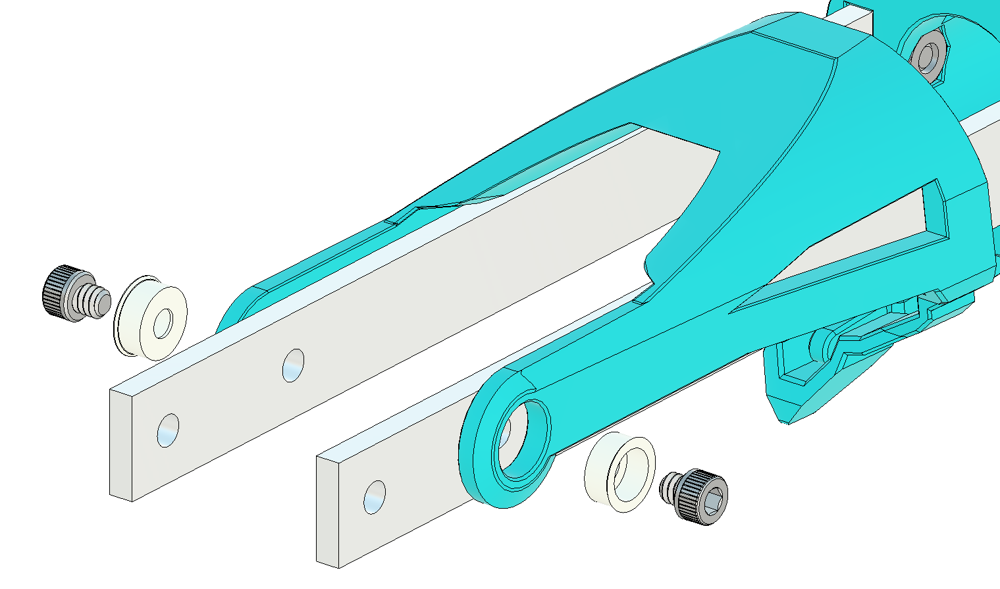
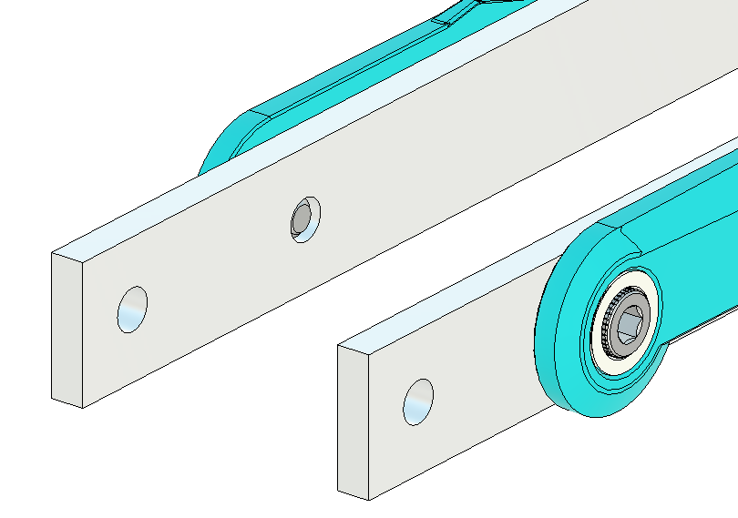

### Step 4
Note: the CatchBearings are considered a semi-consumable part. They can wear out over time, especially if they are detached and reattached.

### Step 5
Warning: Installing the PlungerAssembly upside-down can cause the core to jam closed. Pay careful attention to alignment.

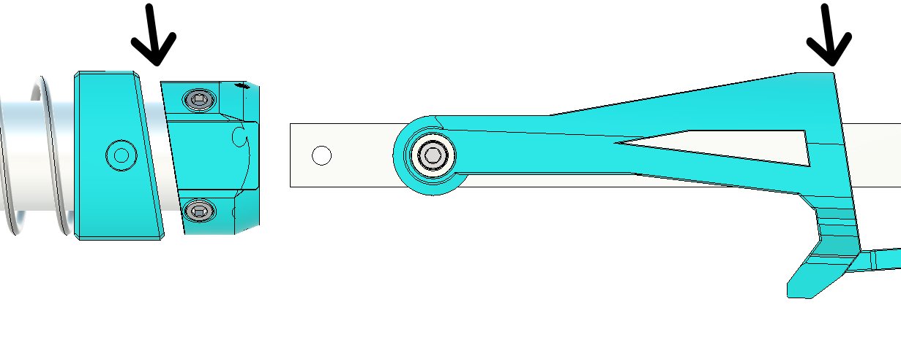
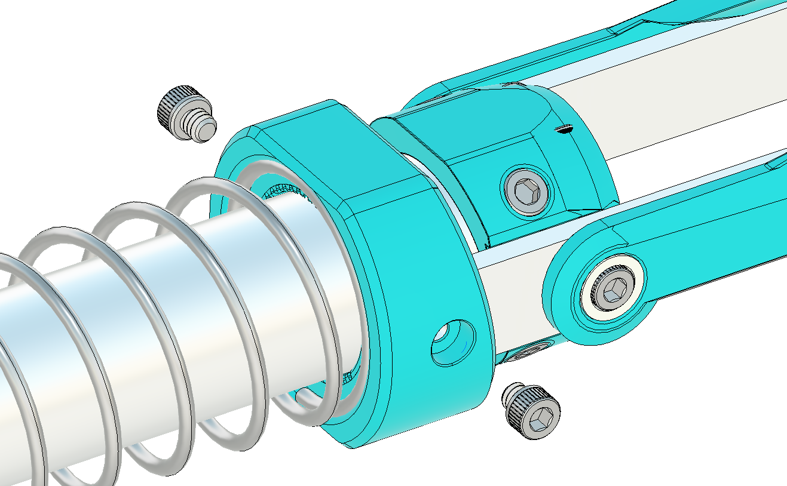
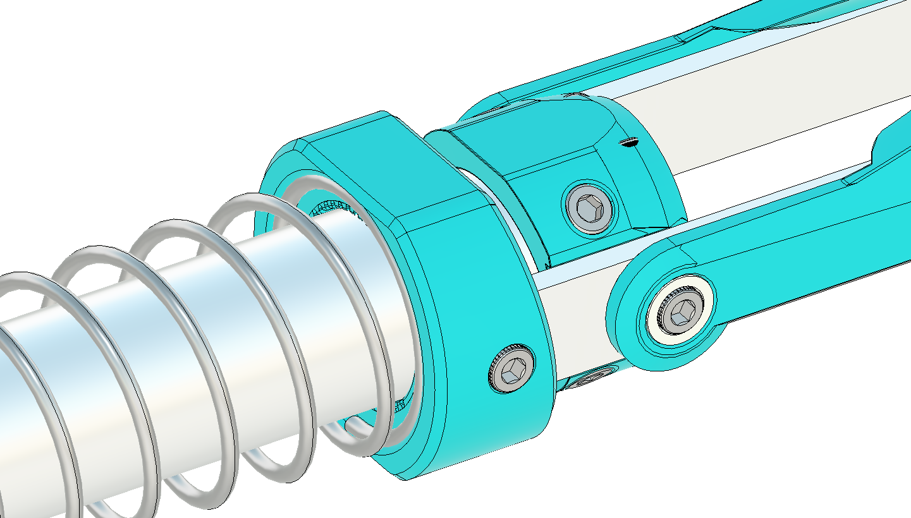

### Step 6
Line up the Plunger Assembly with the PrimeBlock Assembly,  making sure the angle of the CatchEnd aligns with the face of the Catch. Slide the Plunger Assembly into the CatchEnd, then secure with (2) 6-32 ⅛” Socket Head Screw
