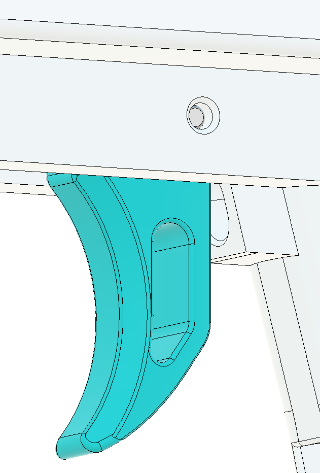

# Core Final Assembly

## Step 1: Install catch on prime block
- Slide Catch onto the PrimeBlock assembly so it sits just in front of CatchLever.
- Ensure orientation is correct: point side down, larger face toward PrimeBlock.

## Step 2: Install catch lever spring
- Rotate CatchLever down and insert a 0.625 inch compression spring in the PrimeBlock spring pocket.
- Rotate CatchLever up to trap the spring in the lever indent.
- Slide Catch under CatchLever to lock engagement.

## Step 3: Attach catch to pump bars
- Attach Catch to PumpBars with two CatchBearings and two 6-32 socket head screws.
- Loctite is highly recommended.

## Step 4: Install plunger assembly into prime block
- Align CatchEnd angle with Catch face.
- Slide Plunger Assembly into position.
- Secure with two 6-32 socket head screws.
- Verify orientation before fastening to avoid core jam.

