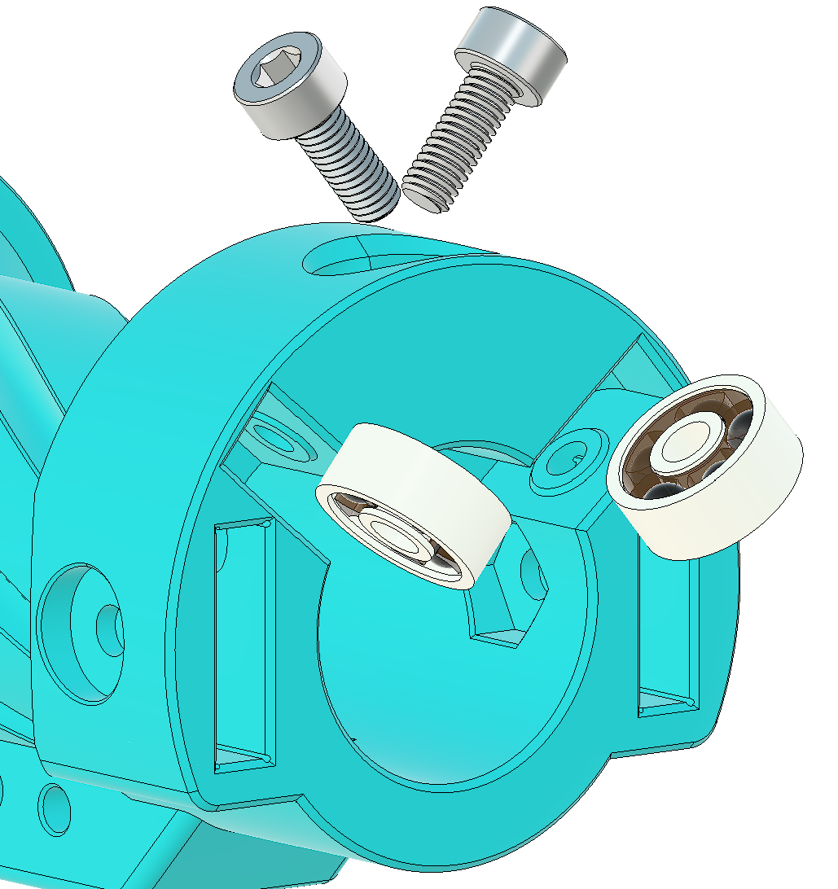

# Core Plunger Sub-Assembly

## Step 1: Prep sliding interfaces
- Clean center through-holes of PlungerHead, CatchEnd, and SpringBase.
- Remove stray plastic and smooth only as needed to reduce friction.
- Keep key internal ridges intact.

## Step 2: Test-fit on barrel and catch tube
- Verify PlungerHead and CatchEnd slide freely on Barrel.
- Verify SpringBase slides freely on CatchTube.
- Adjust fit only until motion is smooth with minimal resistance.

## Step 3: Align catch tube in plunger head
- Insert CatchTube into PlungerHead and rotate until hole patterns align.
- Confirm all four holes align, then rotate to hide holes for insert installation.

## Step 4: Install heat-set inserts and o-rings
- Install four 6-32 heat set inserts in PlungerHead until seated against CatchTube.
- Let cool, verify CatchTube rotation, then remove CatchTube.
- Install one 127 o-ring around PlungerHead and one 016 o-ring inside.
- Install a second 127 o-ring as front bumper, or use optional TPU bumper.

## Step 5: Install catch end
- Slide CatchEnd onto CatchTube and align holes.
- Install four 6-32 socket head screws and tighten flush without overtightening.
- Loctite is recommended.
- Confirm CatchEnd slides freely on Barrel.

## Step 6: Install spring base and spring
- Slide SpringBase onto CatchTube with angled face oriented toward CatchEnd.
- Rotate until angled faces align.
- Slide Spring onto CatchTube and seat spring base in the groove.

## Step 7: Install plunger head screws
- Push PlungerHead onto CatchTube fully and align holes.
- Install four 6-32 Phillips screws into the aligned CatchTube holes.
- Verify screw heads sit below the 127 o-ring to avoid tube scraping.
- Confirm SpringBase can move freely and compress the spring.

## Step 8: Lubricate and motion check
- Apply lubricant to the inner 016 o-ring.
- Verify full assembly moves freely on Barrel after lube distribution.

