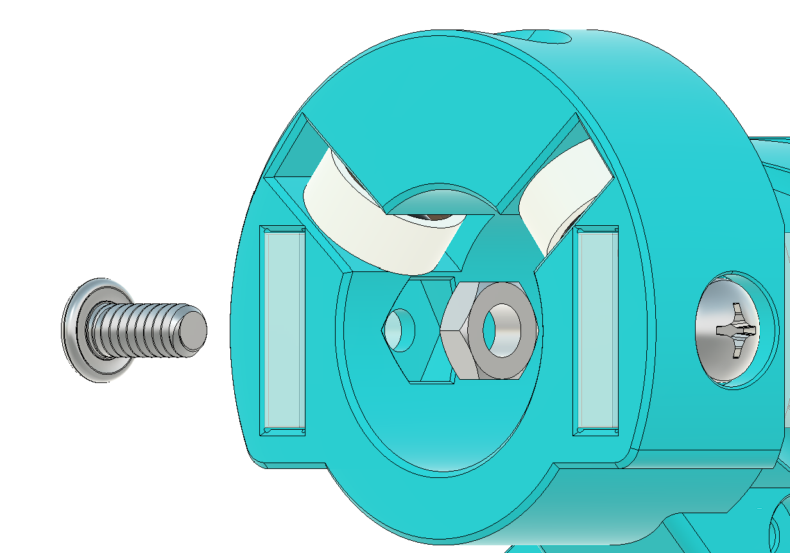

# Gear Tensioner Assembly

[View Materials List](materials.md)

## Overview
Build the front connector and gear train, then install lock and tensioning hardware.

## Steps

### Step 1: Prepare inner gear screw and nut
- Insert a 1-1/4 inch 10-32 screw into InnerGear from the circular side.
- Thread a 10-32 nut until seated in the underside cutout.
- Apply a small amount of superglue to secure the screw head/threads and seat fully.
- Allow adhesive to cure before continuing.

### Step 2: Build connector cap gear stack
- Place FrontConnectorCap on the selected shroud.
- Fasten with two 6-32 x 5/16 screws in the inner bottom holes.
- Lightly lubricate the gear bed and install BarrelGear, SideGears with 3/4 inch dowels, OuterGear, and InnerGear.
- Place washer above InnerGear.

### Step 3: Prepare tensioner block
- Insert a 10-32 nut into TensionerBlock.
- Press NutCap in until it clicks into side grooves.
- Test fit the tensioner pin path across the block.

### Step 4: Install heat set insert
- Install a 6-32 heat set insert into FrontConnectorBase top hole.
- Press straight and flush using a soldering iron at correct temperature.

### Step 5: Join base to cap assembly
- Align both dowels, the center inner-gear screw hole, and top side grooves.
- Press FrontConnectorBase onto FrontConnectorCap until snug.

### Step 6: Install lock hardware
- Fasten selected shroud into FrontConnectorBase with one 6-32 x 5/16 screw from top.
- Install two 6-32 x 5/8 socket head bolts from shroud side.
- Insert two 6-32 nuts into side slots.
- Install two LockBlocks (tapered side down), then LockBlockCap and secure with one 6-32 x 5/16 screw.

### Step 7: Install tensioner block and thumbscrews
- Insert TensionerBlock from bottom with smaller face up.
- Thread two 6-32 thumbscrews into captive nuts above LockBlocks.
- Rotate OuterGear to move TensionerBlock until through-hole aligns.
- Verify thumbscrews drive LockBlocks inward, then back off for later barrel install.

