# Loader Assembly

[View Materials List](materials.md)

## Steps

### Step 1
The Loader Assembly is responsible for loading a dart and sealing it within the barrel/turnaround. It is moved by the core during the prime cycle.

### Step 2
Install a 1/4"-20 3/8" Screw through a 202 O-Ring into the front of the Pusher. Tighten until the O-Ring seals when inserted into the back of the Turnaround without being overly tight. This seals behind the dart, and so an airtight seal is important for the overall performance of a blaster. Being overly tight however will make priming the blaster less smooth, so the trick is finding the balance between the two. Note that bolt action cores lock the Loader Assembly in place and so can get away with a looser seal. Straight pull cores require a tight enough seal that the assembly doesn’t get blown out when fired. See Tuning/Maintenance for more info on tuning the seal.

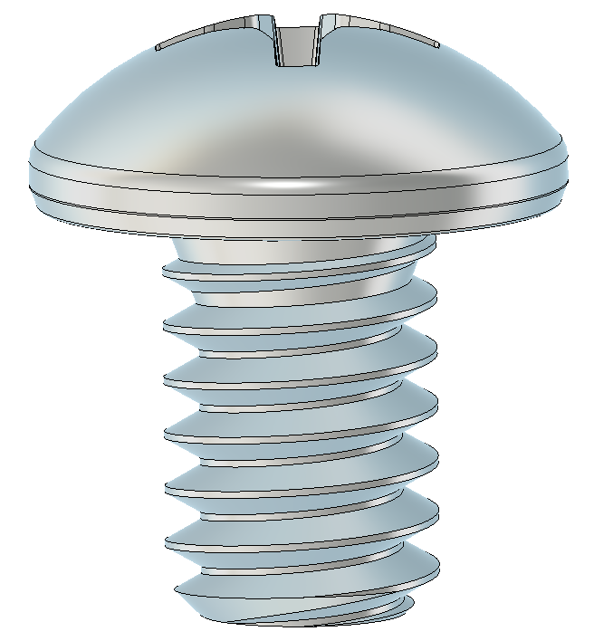
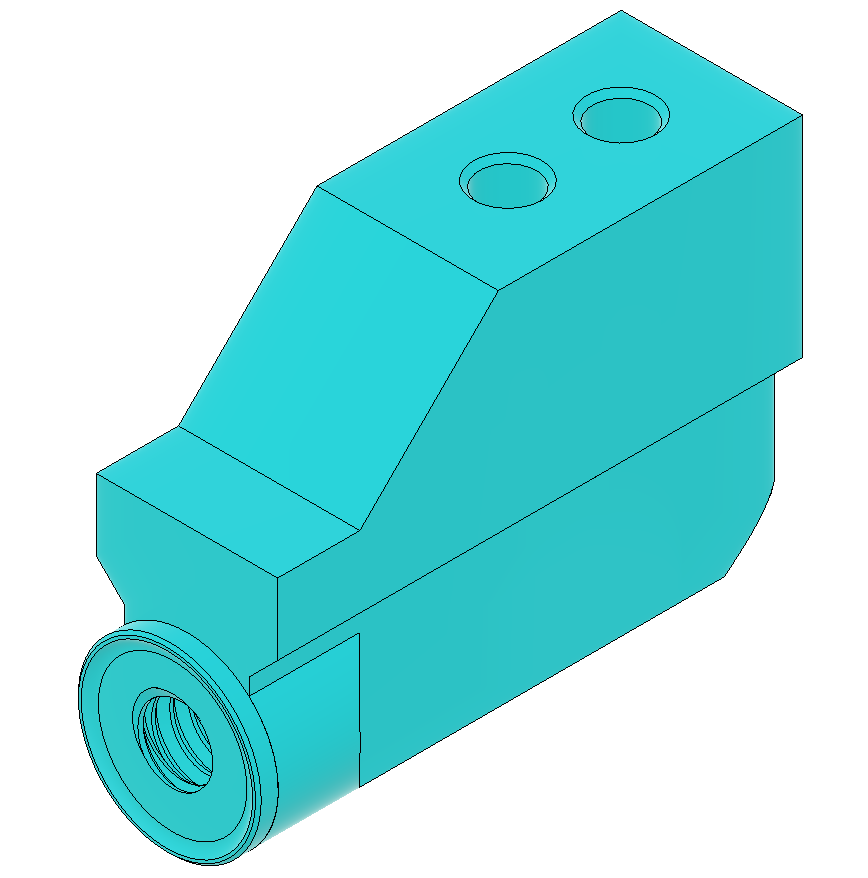
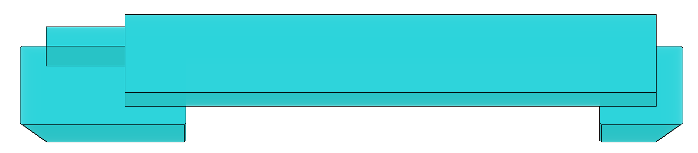
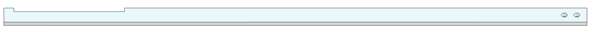

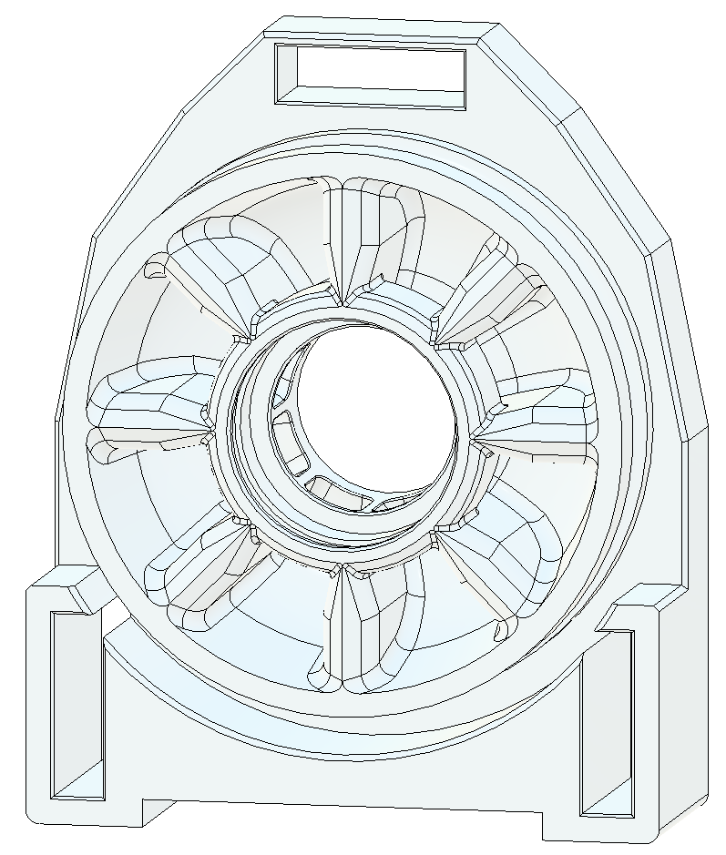

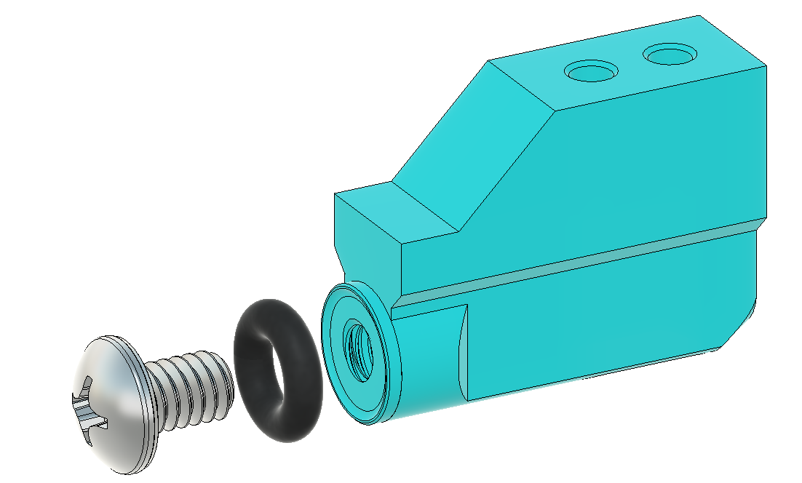
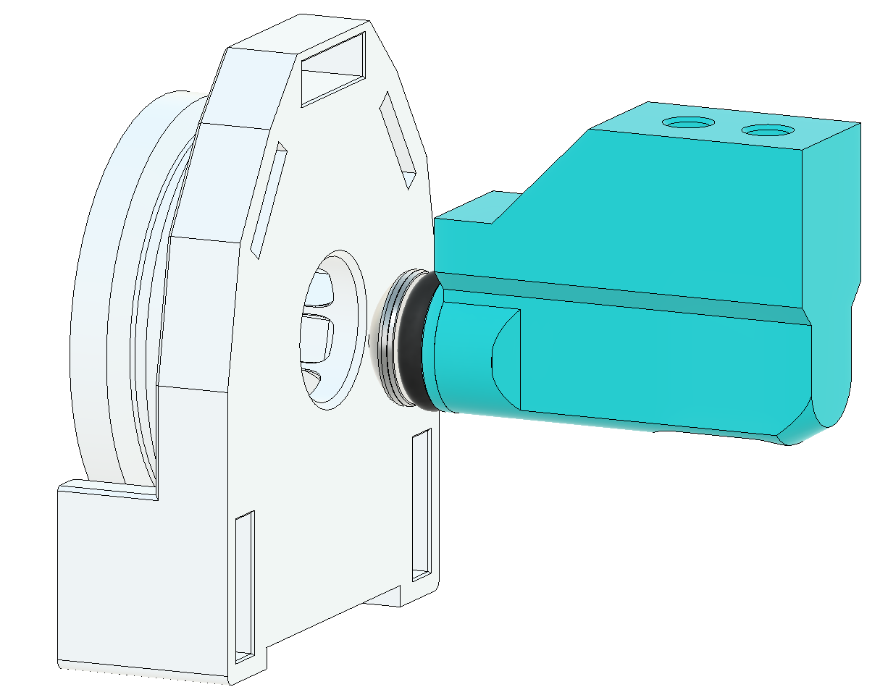

### Step 3
Test that the TransferBarAdapter fits on the front of the TransferBar. It should slide into the cutout and be flush with the sides of the TransferBar. This piece will need to be removed and reattached when assembling/disassembling the blaster, so make sure the piece fits in smoothly, sanding/adjusting print tolerances if needed.

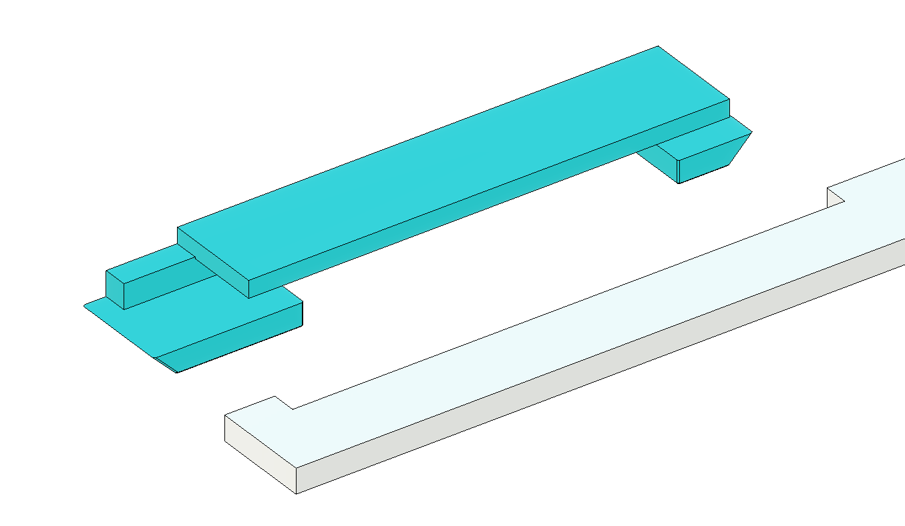
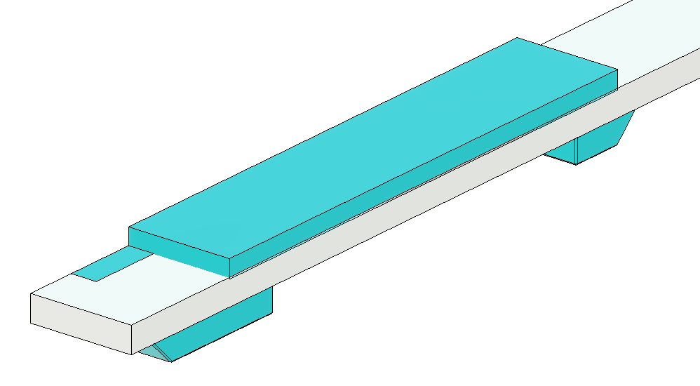
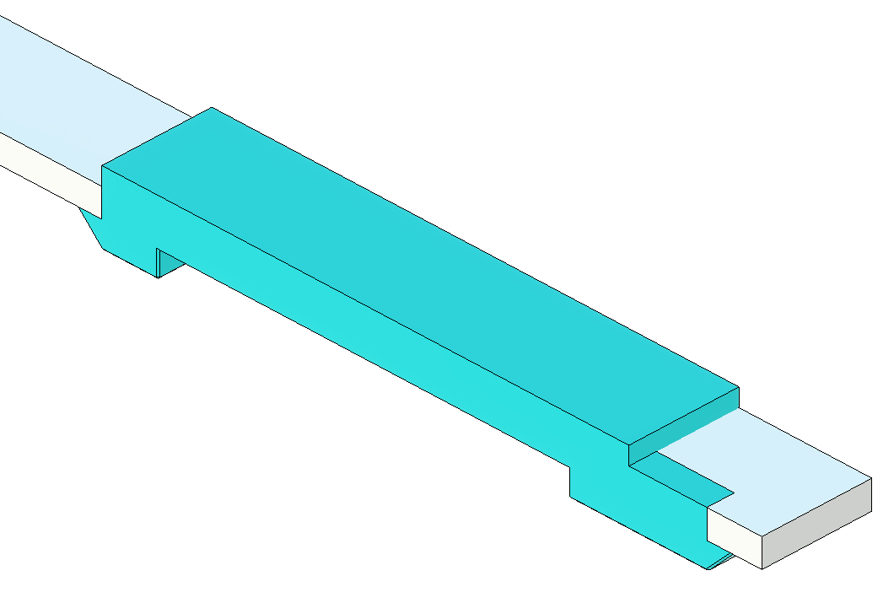

### Step 4
Install the Pusher onto the TransferBar, making sure it is aligned as shown above using (2) 6-32 ⅝” Socket Head Screw. The Pusher needs to be on the same side of the TransferBarAdapter that has the center cutout, as this is what will be in contact with the PrimeBlock.

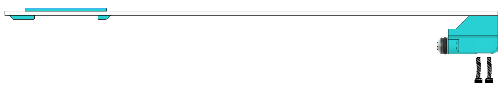
