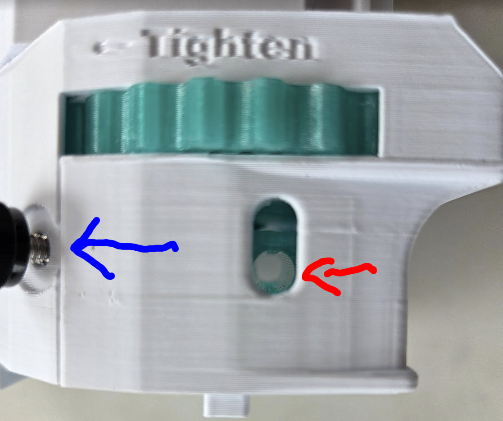

# Prime Block Common Assembly

## Step 1: Install front bearing pair
- On the front side of the PrimeBlock, install two 623 POM bearings.
- Secure with two 8 mm M3 socket head screws through the top.
- Ensure each screw passes through the bearing center and does not pinch the race.

## Step 2: Install rear bearing pair
- On the rear side of the PrimeBlock, install two 623 POM bearings.
- Secure with two 8 mm M3 socket head screws.
- Inverted assembly orientation can make this placement easier.

## Step 3: Set barrel center support bearing
- Rotate PrimeBlock upside-down and pass the barrel through the center.
- Place one 623 POM bearing in the center slot.
- Tune bearing position for smooth barrel movement, then secure with one 8 mm M3 screw.

## Step 4: Install pump bars
- Align PumpBars at the rear of PrimeBlock with wider-spaced holes facing the block.
- Slide bars until flush with the front and verify hole alignment.
- Use gentle tapping only if required for fitment.

## Step 5: Install catch lever
- Position CatchLever in the bottom-rear cutout and align pivot hole.
- Insert one 3/32 inch dowel through the side to retain the lever.
- Ensure lever rotates freely after dowel is seated.

