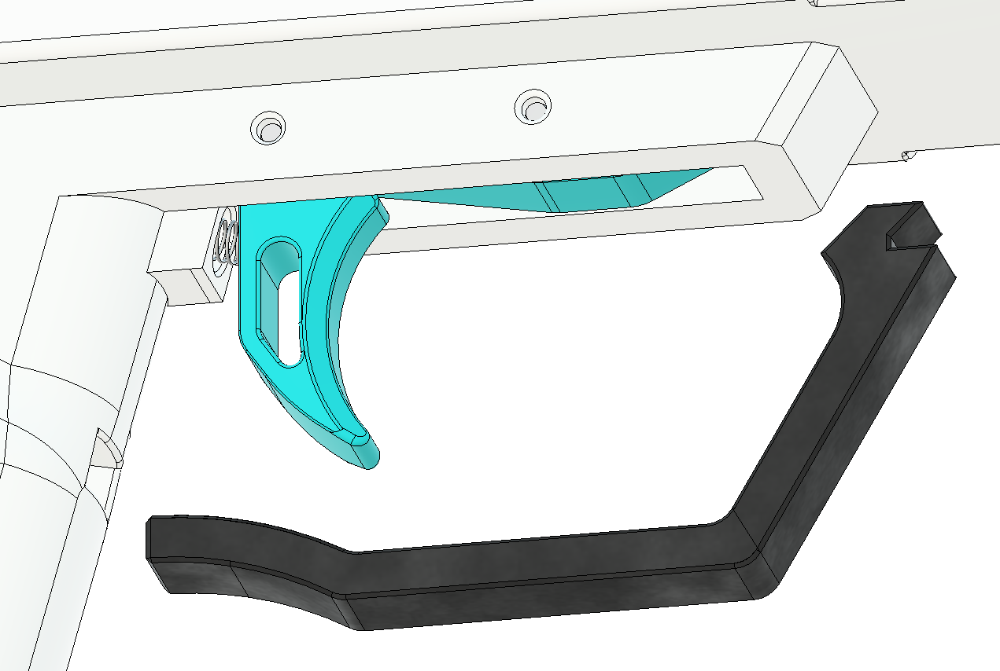

# Prime Block Dual Straight Pull Assembly

## Overview
Follow common assembly first, then install mirrored straight-pull reinforcement and hardware on both sides.

## Steps

### Step 1: Complete common assembly
- Finish all steps in [Common Assembly](common-assembly.md).

### Step 2: Install mirrored front and rear anchors
- Install 6-32 hex nuts and 6-32 Phillips screws at front and rear on both sides through pump bars.

### Step 3: Install reinforcement hardware
- Install top rear 6-32 socket head screws.
- Install handle reinforcement screws and verify free movement.

### Step 4: Install handle heads and bottom bearings
- Install both handle heads and secure with 6-32 socket head screws.
- Install bottom 623 bearings with 8 mm M3 socket head screws.

