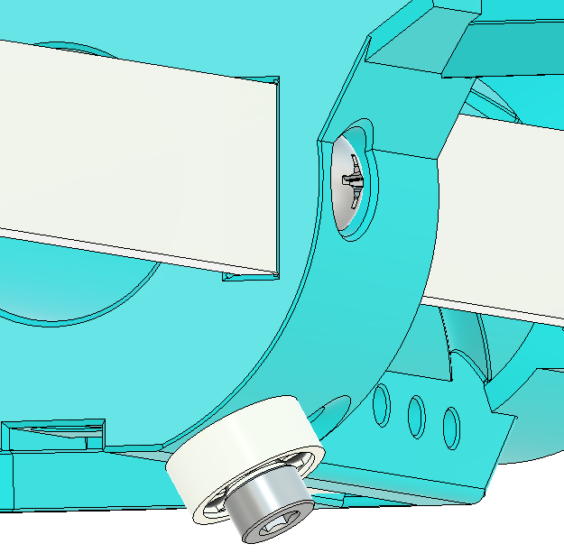

# Prime Block Straight Pull Assembly

## Overview
Follow the same fastening and reinforcement sequence as bolt action unless your printed variant has geometry-specific differences.

## Steps

### Step 1: Complete common assembly
- Finish all steps in [Common Assembly](common-assembly.md).

### Step 2: Install front and rear anchor hardware
- Install front and rear 6-32 hex nuts and 6-32 Phillips screws through pump bars on both sides.

### Step 3: Install reinforcement screws
- Install top rear 6-32 socket head screws, then handle reinforcement screws.
- Keep torque moderate to avoid thread damage in printed parts.

### Step 4: Install handle heads and bottom bearings
- Install handle heads with 6-32 socket head screws.
- Install bottom 623 bearings with 8 mm M3 socket head screws.

