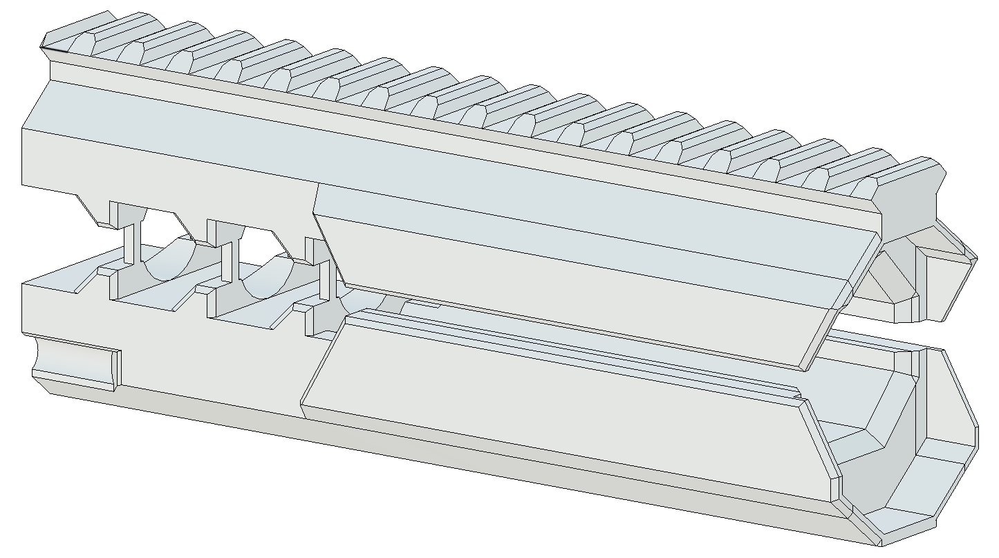
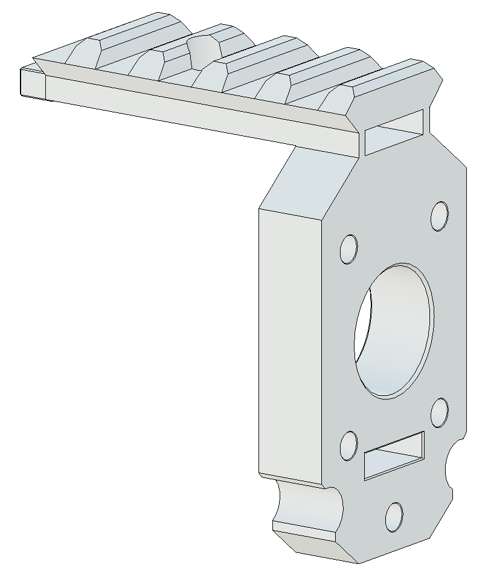
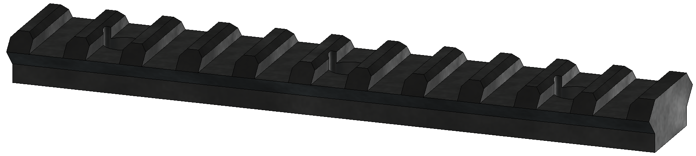
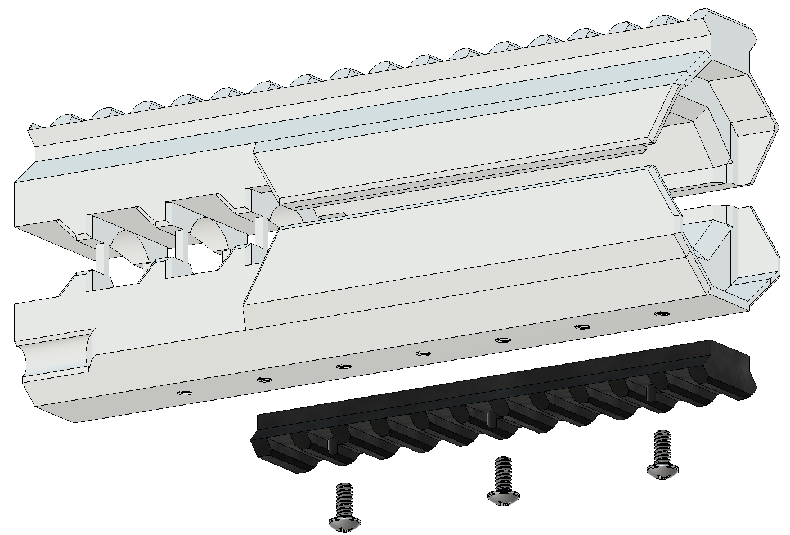
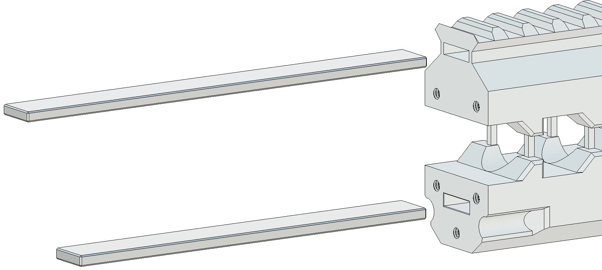
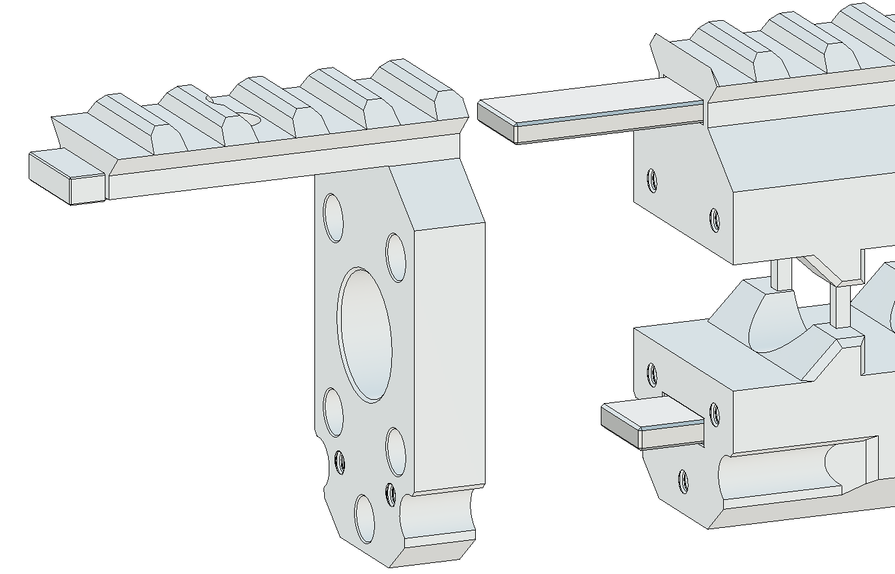
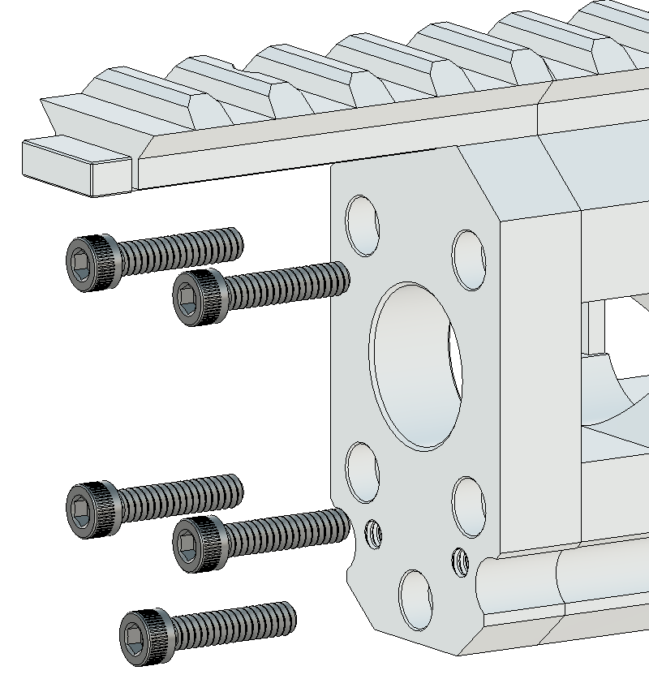
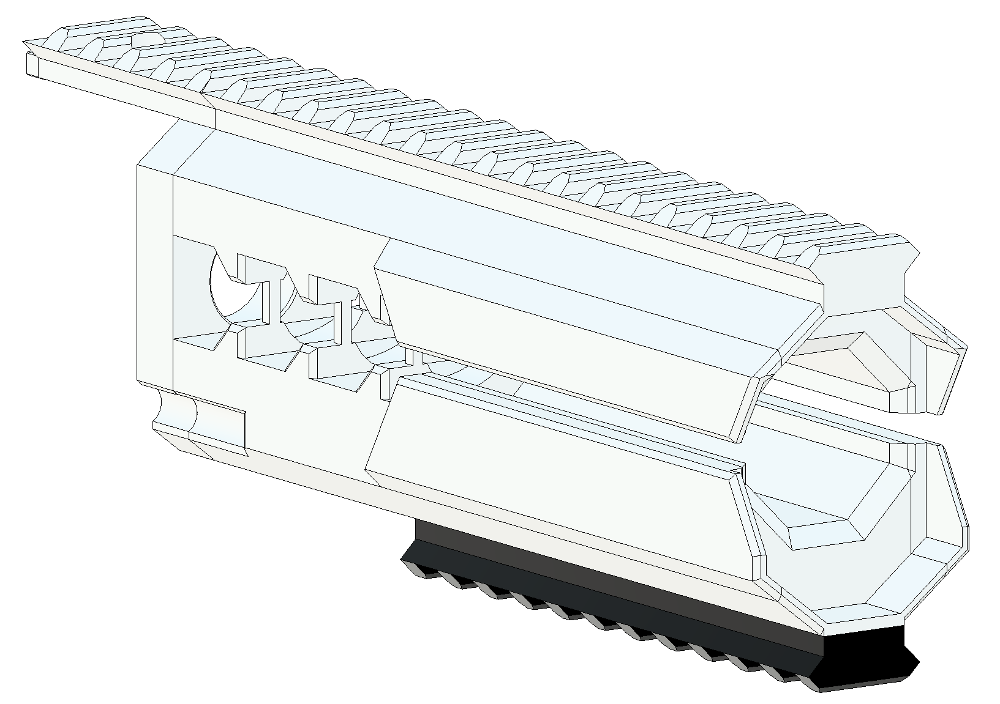
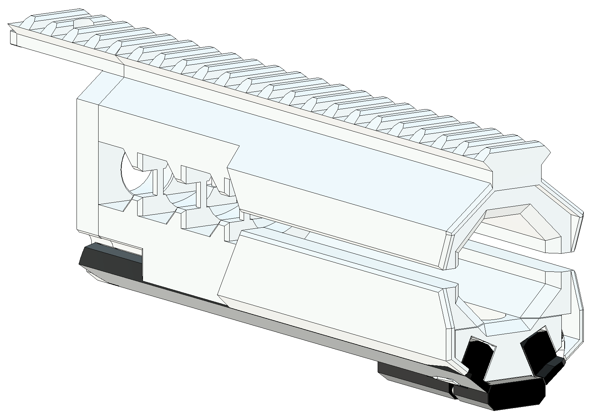

# Railgun Variant

## Steps

### Step 1
Install your chosen length of RG_BottomRail to the bottom of RG_MainBody with (3) 6-32 ⁵⁄₁₆”  Phillips Screws.

### Step 2
Insert the longer RG_TopSupportBar and the shorter RG_BottomSupportBar into the respective slots in the rear of RG_MainBody. Depending on print tolerances, they may require gentle encouragement with a hammer. Make sure they are inserted fully.

### Step 3
Install RG_Base to RG_MainBody, making sure the support bars seat correctly within the base then secure with (5) 6-32 ⅝“ Socket Head Screws, careful not to overtighten.

