# Turnaround Assembly

[View Materials List](materials.md)

## Steps

### Step 1
The Plunger Tube Assembly consists of the PlungerTube as well as the components that hold it on either end. The PlungerTube ultimately houses the Plunger Sub Assembly. Upon firing, the PlungerHead moves rapidly down the PlungerTube, moving air back and into the Turnaround which then redirects air into the Barrel behind the dart.

### Step 2
Apply some superglue to the angled face and top of the TubeHolderInsert, then insert it into the front side of the TubeHolder. Make sure the PlungerTube fits into the back of the TubeHolder. Remove the PlungerTube and set aside.

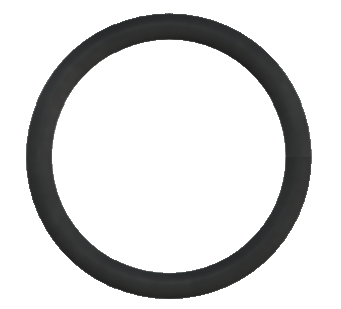
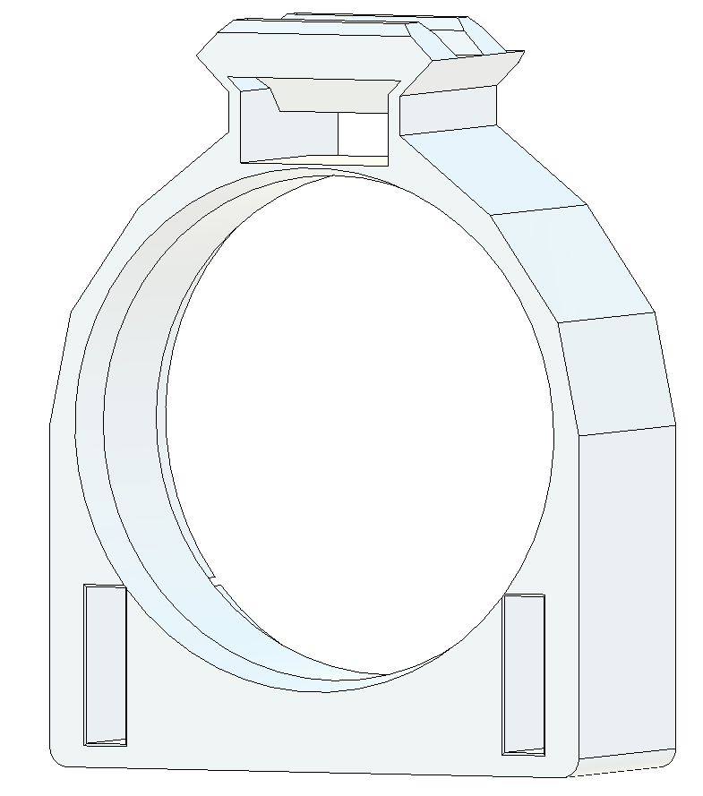
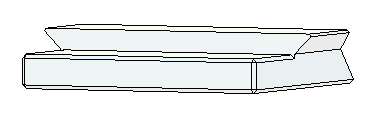
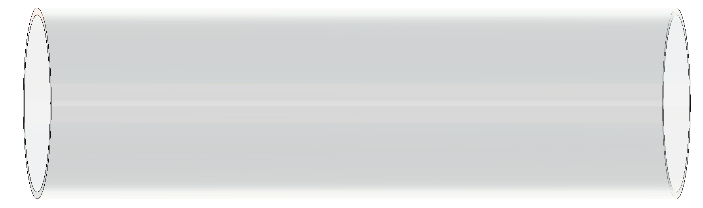
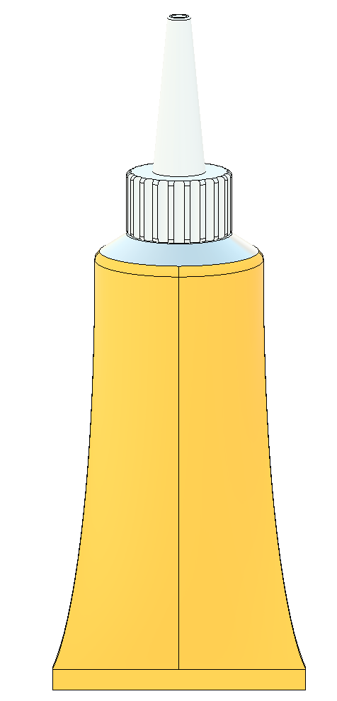

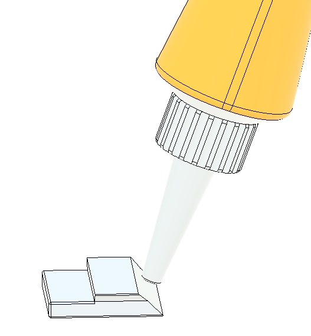
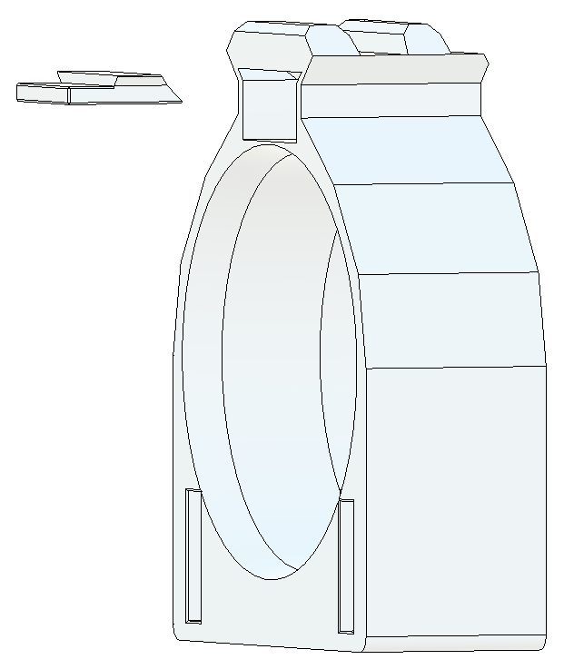
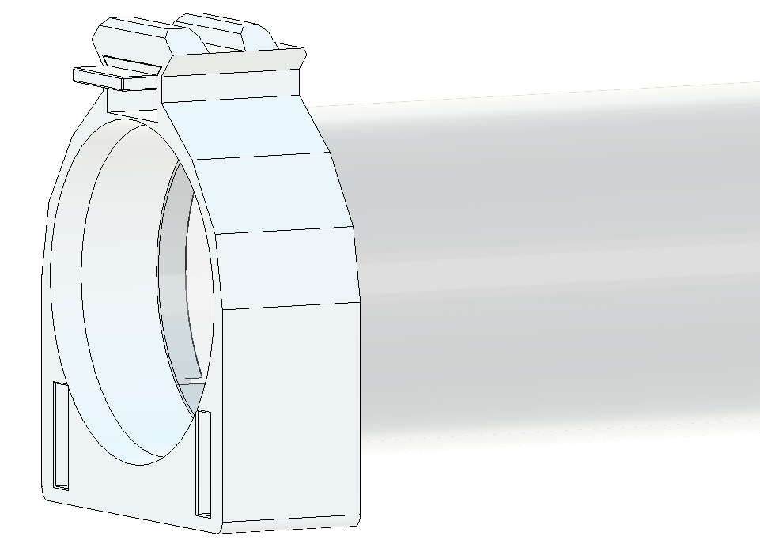

### Step 3
Install a 016 O-Ring in the groove on the inside of the Turnaround (first photo). Install a 127 O-Ring in the outer groove of the central section of the Turnaround. The bottom portion of the O-Ring may require pushing in with a screwdriver.

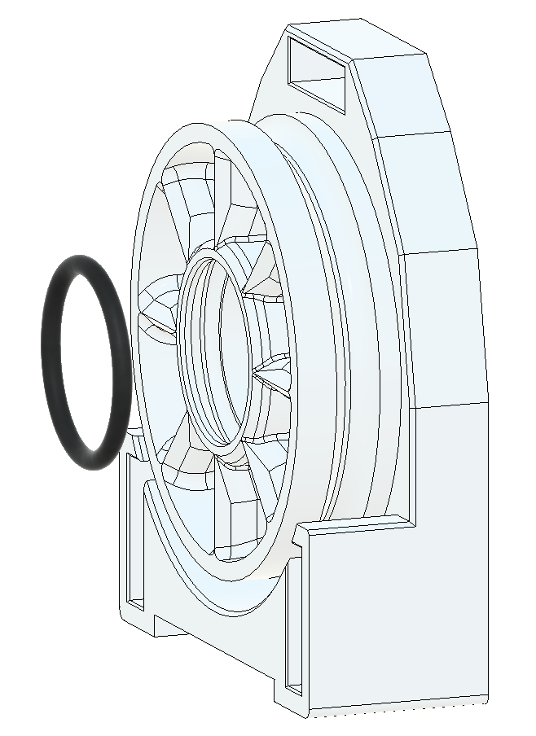
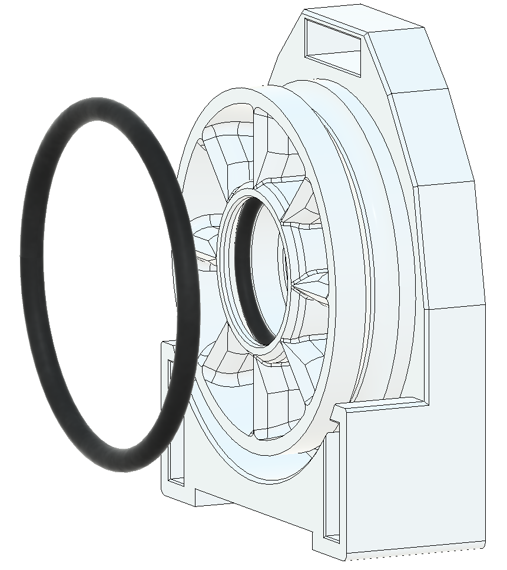
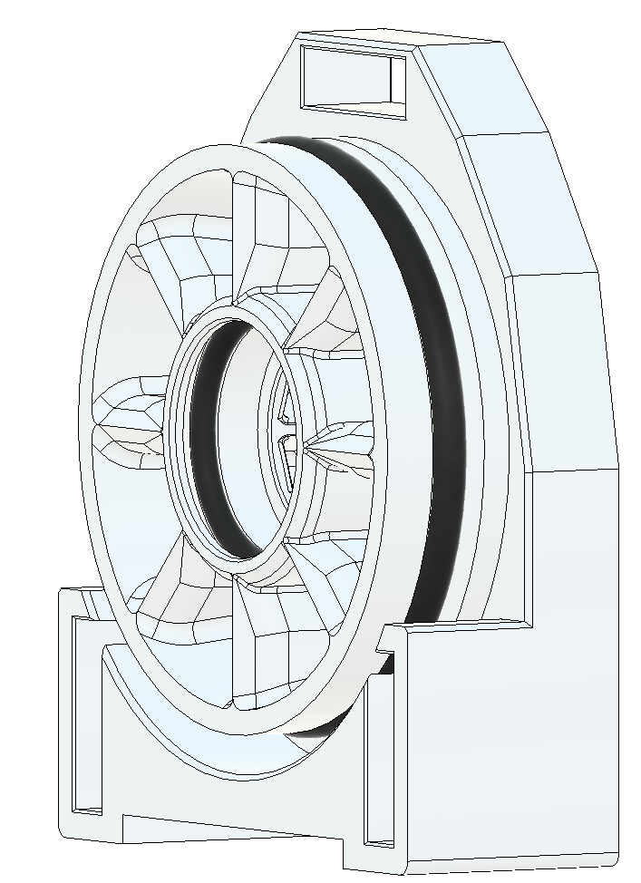

### Step 4
Clean out the PlungerTube, removing any dust or debris. Then, push it onto the front of the Turnaround over the 127 O-Ring until it is seated firmly against the back of the Turnaround. Make sure the 127 O-Ring is fully seated within the groove in the Turnaround and fully inside the PlungerTube, and that it is not buckled or pushed out of the PlungerTube. This should be a relatively tight fit and may require some finessing. Lube is optional, but used sparingly can help get the PlungerTube seated properly.

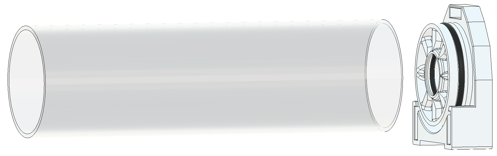
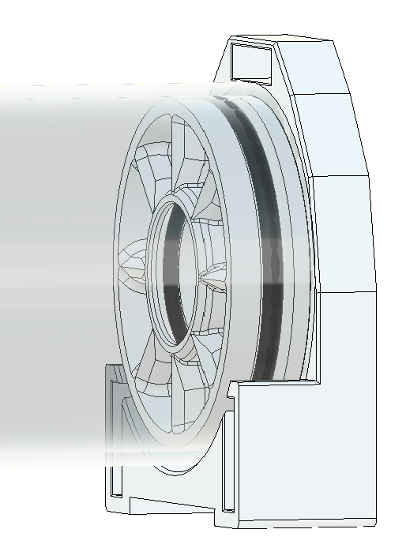
